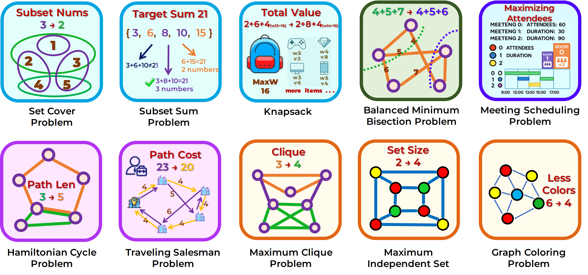

# NP-Engine: Empowering Optimization Reasoning in Large Language Models with Verifiable Synthetic NP Problems
<div align="center">
 
</div>
<div align="center">
[📃[Paper](http://arxiv.org/abs/2506.10764)]
[🌐[Project Page](https://github.com/OliverLeeXZ/NP-Engine)]
[🤗[Model](https://huggingface.co/OliverLee/Qwen2.5-7B-NP)]
</div>


## 📣 What's New
- **[2025.10.14]** We have released NP-Bench in [OliverLeeXZ/NP-Engine](https://huggingface.co/datasets/OPT-Bench/OPT-Bench). 🎉🎉🎉
- **[2025.10.13]** We have released model checkpoint in [OliverLee/Qwen2.5-7B-NP](https://huggingface.co/OliverLee/Qwen2.5-7B-NP). 🎉🎉🎉
<!-- - **[2025.6.10]** Our OPT-BENCH Paper is released! Check it at 📃[Arxiv: OPT-BENCH](http://arxiv.org/abs/2506.10764) ! Our Dataset will be open-sourced soon! 🎉🎉🎉 -->

## 👨‍💻 Todo List

- ✅ Paper Release
- ✅ Checkpoint Release
- ✅ NP-Bench Release
- ⏳ RLVR Training Code Release [*Coming Soon*]
- ⏳ Training Data Release [*Coming Soon*]


## 🌟 Highlights


- **We introduce NP-ENGINE**, a scalable framework that generates near-infinite and hierarchically difficult NP-hard problems within the RLVR paradigm, empowering LLMs' optimization reasoning abilities. NP-ENGINE enables Qwen2.5-7B-Instruct to significantly outperform GPT-4o in optimization reasoning tasks using only 5K training examples.

- **We propose NP-BENCH**, a benchmark consisting of 10 NP-level tasks spanning five categories: Graph Clustering, Resource Scheduling, Graph Partitioning, Subset Selection, and Path Planning. NP-BENCH provides instances with varying difficulty levels and evaluates both the feasibility and quality of solutions.

- **Through extensive experiments**, we demonstrate that training on NP-ENGINE-DATA enables QWEN2.5-7B-NP to generalize to both reasoning and non-reasoning OOD tasks. We also observe a positive correlation between task diversity and cross-task generalization performance, offering new insights into the scaling behavior of RLVR-based training.

## 📚 Dataset Statistics
<div align="center">
 
</div>


<div align="center">
 
</div>

## 🏆 NP-Bench Leaderboard
## Performance of reasoning LLMs, general LLMs, and our trained LLMs on \bench.

| **Model**              | **Graph SR** | **Graph AR** | **Schedule SR** | **Schedule AR** | **Partition SR** | **Partition AR** | **Selection SR** | **Selection AR** | **Planning SR** | **Planning AR** | **Overall SR** | **Overall AR** |
|------------------------|--------------|--------------|-----------------|-----------------|------------------|------------------|------------------|------------------|-----------------|-----------------|----------------|----------------|
| **Proprietary LLMs**    |              |              |                 |                 |                  |                  |                  |                  |                 |                 |                |                |
| DS-V3.1-Thinking        | 86.0         | 78.2         | **99.0**        | 91.4            | 98.0             | **77.1**         | **99.3**         | **98.5**         | 61.9            | 54.3            | 88.8           | **79.9**       |
| gpt-o3                  | **97.0**     | **86.4**     | **99.0**        | **94.5**        | **100.0**        | 51.4             | 87.4             | 87.3             | 74.0            | **65.1**        | 91.5           | 76.9           |
| Qwen3-235B-Thinking     | 66.7         | 62.9         | 95.0            | 93.0            | **100.0**        | 55.8             | 98.0             | 97.1             | 52.0            | 44.8            | 82.3           | 70.7           |
| gpt-4o-2024-08-06      | 64.7         | 29.3         | 79.0            | 59.8            | **100.0**        | 53.0             | 14.7             | 9.3              | 52.0            | 29.6            | 62.1           | 36.2           |
| **Open-Source LLMs**    |              |              |                 |                 |                  |                  |                  |                  |                 |                 |                |                |
| Qwen3-32B               | 44.7         | 39.3         | 94.0            | 93.9            | 99.0             | 52.6             | 94.1             | 91.4             | 21.6            | 11.2            | 70.7           | 57.6           |
| Qwen3-8B                | 22.7         | 16.8         | 78.0            | 75.3            | 98.0             | 51.0             | 86.0             | 82.6             | 3.0             | 1.2             | 57.5           | 45.4           |
| DS-R1-Qwen-32B          | 23.3         | 18.1         | 49.0            | 45.1            | 96.0             | 48.6             | 85.7             | 79.7             | 15.4            | 7.9             | 53.9           | 39.9           |
| DS-R1-Qwen-14B          | 18.0         | 13.4         | 52.0            | 51.7            | 32.0             | 16.2             | 67.3             | 63.4             | 4.5             | 1.4             | 34.8           | 29.2           |
| Qwen2.5-72B             | 34.7         | 15.2         | 59.0            | 58.5            | 90.0             | 39.5             | 27.0             | 17.4             | 6.5             | 2.1             | 43.4           | 26.5           |
| Qwen2.5-32B             | 35.3         | 15.2         | 15.0            | 12.8            | **100.0**        | 51.7             | 32.0             | 22.4             | 23.5            | 6.7             | 41.2           | 21.8           |
| Qwen2.5-14B             | 30.0         | 11.5         | 21.0            | 15.8            | 89.0             | 44.3             | 23.3             | 12.7             | 17.5            | 4.9             | 36.2           | 17.8           |
| InternLM3-8b            | 15.0         | 3.6          | 20.0            | 9.5             | 86.0             | 43.3             | 41.3             | 23.7             | 16.0            | 4.1             | 35.7           | 16.8           |
| LLama3.1-8B             | 23.0         | 8.0          | 9.0             | 7.8             | 0.0              | 0.0              | 28.7             | 11.4             | 15.0            | 1.8             | 15.1           | 5.8            |
| Qwen2.5-3B              | 7.7          | 2.9          | 17.0            | 5.0             | 6.0              | 2.2              | 23.0             | 10.7             | 15.5            | 3.7             | 13.8           | 4.9            |
| DS-R1-Qwen-7B           | 6.3          | 1.9          | 1.0             | 0.9             | 2.0              | 1.0              | 13.7             | 8.9              | 0.5             | 0.1             | 4.7            | 2.5            |
| Qwen2.5-7B              | 11.0         | 3.1          | 40.0            | 19.8            | 67.0             | 34.0             | 26.7             | 15.2             | 3.5             | 1.0             | 29.6           | 14.6           |
| **Model**               | **89.7**     | **27.8**     | **85.0**        | 43.5            | **99.0**          | **53.8**         | **93.7**         | **79.1**         | **98.2**         | **28.9**         | **93.1**        | **46.6**        |
| **Delta**               | +78.7        | +24.7        | +45.0           | +23.7           | +32.0            | +19.8            | +67.0            | +63.9            | +94.7            | +27.9            | +63.5           | +32.0           |

<div align="center">
 
</div>
Evaluation Results of LLMs on OPT-BENCH-ML. The column Win Count denotes the win count comparing the performance of LLM optimization using OPT-Agent against the baseline without historical information; IR(w,w.o) represents the improvement rate of OPT-Agent relative to the baseline; and IR(w,init) indicates the improvement relative to the initial solution. Evaluation Results of LLMs on OPT-BENCH-ML.
<div align="center">
 
</div>
Evaluation Results of LLMs on OPT-BENCH-NP. The column Win Count denotes the win count comparing performance of LLM optimization using OPT-Agent against the baseline without historical information; Buggy Rate indicates the proportion of tasks where the model fails to produce a valid solution; Rank reflects the relative ranking of the model’s optimization outcomes per task.
<div align="center">
 
</div>
Evaluation Results of LLMs under Draft Settings. Metrics include Buggy Rate, denoting the proportion of invalid solutions; Win Count, comparing OPT-Agent-draft optimization against the baseline without historical information; and IR(d,r), the improvement rate comparing OPT-Agent-draft optimization to OPT-Agent-refine.
# OPT-BENCH

## Setup
Make sure you have ```Python>=3.10``` installed and run:
```
pip install -r requirements.txt
```

## Inference Example

### API Model
```
export API_KEY="Your api key"
export BASE_URL="Your api URL"
```
### Open-sourced Model

We recommend that deploy model using lmdeploy.
```
export export API_KEY=EMPTY
export BASE_URL="Your model URL"
```
### For ML task
```
cd OPT-BENCH
python run_exp.py --data_dir OPTAgent/example_tasks/spaceship-titanic --steps 1 --base_model gpt-4o-2024-08-06
```

### For NP task 
```
python run_exp.py --data_dir OPTAgent/example_tasks/hamiltonian-cycle --task_field NP --steps <your steps default is 10> --base_model <your model default is 4o>
```

## For task scale up
```
https://huggingface.co/datasets/OPT-Bench/OPT-Bench
```
### For NP task
Take ```OPTAgent/example_tasks/hamiltonian-cycle``` as the example.
1. Add your date in ```OPTAgent/example_tasks``` dir.
2. Prepare your own task. ``` task description in ## Description section, metric in ## Metric, submission format in ## Submission Format ```.
3. Prepare ``` question.json```. Your question should in ```"question"``` formatted as dict.
4. prepare ```validation.py```. The rule-based validation py script for your task.

Run the ```run_exp.py``` for validation.

### For ML task
Take ```OPTAgent/example_tasks/spaceship-titanic``` as the example.
1. Add your date in ```OPTAgent/example_tasks``` dir.
2. Prepare your own task. ``` task description in ## Description section, metric in ## Metric, dataset description in ## Dataset Description, submission format in ## Submission Format ```.
3. You should prepare ```init.py in ## Code Template``` for ```OPTAgent-refine```, which is optional for ```OPTAgent-draft```.


## 🖊️ Citation

If you find this work helpful, please consider to **star🌟** this repo and cite this paper. Thanks for your support!

```bib
@misc{li2025optbenchevaluatingllmagent,
      title={OPT-BENCH: Evaluating LLM Agent on Large-Scale Search Spaces Optimization Problems}, 
      author={Xiaozhe Li and Jixuan Chen and Xinyu Fang and Shengyuan Ding and Haodong Duan and Qingwen Liu and Kai Chen},
      year={2025},
      eprint={2506.10764},
      archivePrefix={arXiv},
      primaryClass={cs.AI},
      url={https://arxiv.org/abs/2506.10764}, 
}
```

<picture>
  <source
    media="(prefers-color-scheme: dark)"
    srcset="
      https://api.star-history.com/svg?repos=OliverLeeXZ/NP-Engine&type=Date&theme=dark
    "
  />
  <source
    media="(prefers-color-scheme: light)"
    srcset="
      https://api.star-history.com/svg?repos=OliverLeeXZ/NP-Engine&type=Date
    "
  />
  
</picture>